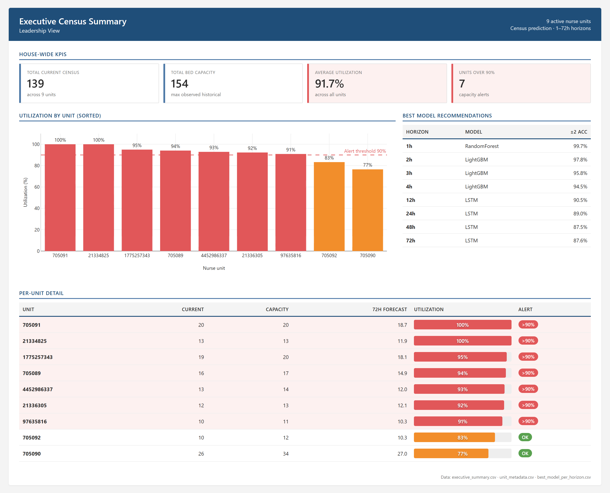

# Nurse Unit Census Prediction

Hourly patient-census forecasting across hospital nurse units, with multi-horizon predictions (1–72 hours) feeding three operational dashboards. End-to-end deployed pipeline from synthetic data feed → forecast generation → published dashboards.

**Live site:** https://joshquigs11093.github.io/Nurse_Unit_Census_Prediction/

| Page | URL fragment |
|---|---|
| Landing — project overview, KPIs, architecture | `/` |
| Model cards — six models with hyperparameters, accuracy tables, strengths/limits | `/models.html` |
| Methodology — pipeline, splits, leakage filtering, evaluation, deployment | `/methodology.html` |
| Dashboards gallery + three full-screen dashboards | `/dashboards.html` |



## What it does

Predicts patient headcount on medical-surgical nurse units at eight forecast horizons (1, 2, 3, 4, 12, 24, 48, 72 hours) using historical admissions, discharges, transfers, ED census, scheduled surgeries, and seasonal patterns. The pipeline trains five model types per unit (ARIMA, Prophet, LSTM, Random Forest, LightGBM) plus a weighted ensemble and exports Tableau-ready CSVs.

**Primary metric:** percentage of forecasts within ±2 patients of actual census. Validation accuracy: 99.7% at 1h (Random Forest), 87.6% at 72h (LSTM).

## Operational architecture

The deployed system simulates the full production flow without exposing real patient-flow data. A daily GitHub Actions cron generates synthetic hourly readings calibrated to the real distributions, runs the prediction logic, and pushes refreshed CSVs and HTML — driving both GitHub Pages and any connected Tableau Public workbooks.

```
                    ┌─────────────────────────────────────────────┐
                    │  GitHub Actions cron — daily 12:15 UTC      │
                    │  (.github/workflows/refresh-forecasts.yml)  │
                    └────────────────────┬────────────────────────┘
                                         │
                       ┌─────────────────┴─────────────────┐
                       ▼                                   ▼
   scripts/generate_synthetic_hour.py        docs/build_dashboards.js --no-screenshots
   (one hour of synthetic ADT per unit,       (regenerates docs/*.html with
    calibrated to historical means/stds)       fresh data inlined)
                       │                                   │
                       ▼                                   ▼
        outputs/tableau/forecast_predictions.csv     docs/dashboard{1,2,3}.html
        outputs/tableau/executive_summary.csv               │
                       │                                   │
                       └──────────────────┬────────────────┘
                                          ▼
                          git commit + push (bot)
                                          │
                       ┌──────────────────┴───────────────────┐
                       ▼                                      ▼
            GitHub Pages auto-rebuild              Tableau Public workbook
            https://joshquigs11093.github.io/      connects via raw.githubusercontent.com
            Nurse_Unit_Census_Prediction/          → daily refresh on Tableau side
```

In a production deployment, `generate_synthetic_hour.py` would be replaced by an ETL job ingesting the live hospital ADT feed; everything downstream (pipeline, exports, dashboards) is unchanged.

## Tech stack

| Layer | Tools |
|---|---|
| Data + features | pandas, numpy |
| Models | scikit-learn (Random Forest), lightgbm, statsmodels (SARIMA), prophet, PyTorch (LSTM) |
| Pipeline orchestration | joblib (parallel per-unit training), PyYAML config |
| Evaluation | custom MAE / RMSE / MAPE / ±2-accuracy metrics, Ljung-Box residual diagnostics |
| Dashboards | Plotly.js + custom CSS, deployed via GitHub Pages |
| Testing | pytest (34 cases covering data leakage, splits, metrics, models) |

## Architecture

```
src/
├── data/data_loader.py            # load · validate · clean · split
├── features/feature_engineering.py # cyclical encoding · leakage-safe feature filter
├── models/
│   ├── base_model.py              # common train/predict/save/load interface
│   ├── arima_model.py             # SARIMA via auto_arima
│   ├── prophet_model.py           # Facebook Prophet w/ holidays
│   ├── lstm_model.py              # 2-layer stacked LSTM (PyTorch)
│   ├── rf_model.py                # sklearn RandomForestRegressor
│   ├── lgbm_model.py              # LightGBM with early stopping
│   ├── ensemble_model.py          # inverse-MAPE weighted average
│   └── model_registry.py          # parallel orchestration across units
├── evaluation/metrics.py          # MAE, RMSE, MAPE, ±2 accuracy, residual diagnostics
└── utils/helpers.py               # config loading, logging, RNG seeding

run_pipeline.py                    # entry point: clean | train | export | all
config/config.yaml                 # all hyperparameters and split dates
tests/test_pipeline.py             # 34 pytest cases

scripts/
├── generate_synthetic_hour.py     # synthetic hourly ADT feed for the deployed demo
└── build_dashboards.js            # generates the static site (HTML + CSS + screenshots)

.github/workflows/
└── refresh-forecasts.yml          # daily cron: synthesize → predict → publish

docs/                              # GitHub Pages site source
├── index.html                     # landing
├── models.html                    # model cards (six)
├── methodology.html               # pipeline walkthrough
├── dashboards.html                # gallery
└── dashboard{1,2,3}.html          # full-screen Plotly dashboards
```

### Key design decisions

- **Per-unit models.** Each nurse unit has distinct census patterns, capacity, and ADT flow. Training a model per unit captures unit-specific dynamics better than a single cross-unit model with unit-as-feature.
- **Horizon-dependent feature filtering.** For forecast horizon H, lag features with lag < H hours are excluded automatically — prevents data leakage and is enforced by tests.
- **Train-once optimization for ARIMA / Prophet.** Univariate models produce identical fits across horizons, so we train once per unit and slice the forecast at each horizon (8× speedup over the naive approach).

## Quick start

```bash
git clone https://github.com/joshquigs11093/Nurse_Unit_Census_Prediction.git
cd Nurse_Unit_Census_Prediction

python -m venv .venv
.venv\Scripts\activate           # Windows
# source .venv/bin/activate      # macOS/Linux

pip install -r requirements.txt

# Place your hourly ADT export at data/raw/postsql.csv, then:
python run_pipeline.py --phase all

# Run tests
python -m pytest tests/test_pipeline.py -v
```

Phases can be run individually: `--phase clean`, `--phase train`, `--phase export`.

## Outputs

| File | Contents |
|---|---|
| `outputs/reports/model_comparison.csv` | (model, unit, horizon) × (MAE, RMSE, MAPE, ±2 acc) |
| `outputs/reports/best_model_per_horizon.csv` | Winning model + accuracy per horizon |
| `outputs/tableau/forecast_predictions.csv` | Wide-format predictions: actual_census + pred_{1..72}hr per (timestamp, unit) |
| `outputs/tableau/executive_summary.csv` | Per-unit current census, capacity, utilization %, 72h forecast, alert flag |
| `models/{unit_id}/...` | Trained per-unit artifacts (joblib, .pt, .json) |

## Site map

The deployed site has four top-level pages plus the three full-screen dashboards:

1. **Landing** (`/`) — hero, KPI cards, operational architecture diagram, featured dashboard preview, quick-link cards.
2. **Model cards** (`/models.html`) — Mitchell-style cards for all six models (RF, LightGBM, LSTM, ARIMA, Prophet, Ensemble) with architecture, hyperparameters, strengths, limitations, and per-horizon validation accuracy tables. Comparison heatmap at the top.
3. **Methodology** (`/methodology.html`) — data, train/val/test split, leakage-safe filtering, per-unit-per-horizon training rationale, evaluation metrics, deployment workflow, reproducibility.
4. **Dashboards gallery** (`/dashboards.html`) — preview cards linking to:
   - **Operational Census Forecast** — house-supervisor view: current census, multi-horizon forecast cards, 7-day actual vs. predicted trend, capacity alerts.
   - **Model Performance Analytics** — process-improvement view: model × horizon accuracy heatmap, per-unit accuracy breakdown.
   - **Executive Census Summary** — leadership view: house-wide KPIs, utilization-by-unit ranking, best-model recommendations, per-unit detail with capacity gauges.

## Privacy

The data feeding this project is de-identified hourly census aggregates — no patient-level information, no PHI. The `data/` directory is gitignored. Sample CSV exports in `outputs/tableau/` contain only aggregate counts.

## License

MIT — see [LICENSE](LICENSE).
